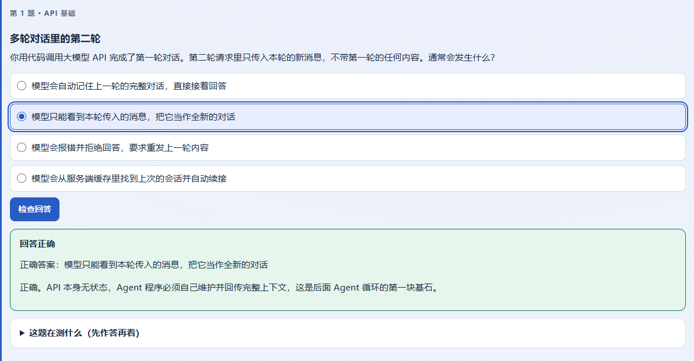
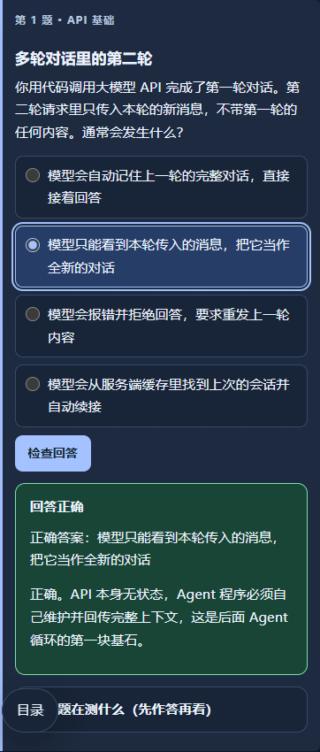

# Test4 入门评估 UI 修复与验证

日期：2026-09-29。基线提交：`3f13550`。课程：智鉴 Agent：智能体开发与安全实战；产物位于 `E:\A_Myskill\teach-pro\TeleAgentTest4\zhi-jian-agent`。生成模型、导入包指纹和本轮 TeleAgent 版本未记录，不推断其值。

## 问题与修复

实际评估页的四道选择题保留了 `data-quiz`、保存键及检查按钮，但省略了 `.quiz-options`、`.quiz-option`、`.quiz-submit`。原样式依赖这些类名，检查按钮的基础布局也不完整；评估模板仅提供内容插槽，输出规范的最小示例使用无类名结构。因此存在生成遗漏与 Skill 模板覆盖不足，不能只归因于 Agent。

- 新增 `teach-pro/templates/quiz.html`，将选项布局、检查按钮、反馈和保存绑定写入可复用片段。
- 评估模板与规范指向该片段，质量检查要求查看实际浅色、深色与窄屏外观。
- 共享 CSS 补全选项与按钮的布局、主题、选中和焦点状态，并兼容保留 `data-*` 而漏写类名的旧页面。
- 同步修复 Test4 现有评估页和仓库示例的共享 CSS；未修改题目内容、保存键、答案值或真实学员数据。

这是模板/运行资源修复及现有页面修订，不是 TeleAgent 使用新包重新生成后已经通过的证明。

## 复测方法与结果

Windows Edge 无头浏览器，Playwright 与 Python 本地服务。浏览器脚本仅向回环地址访问；公开课程文件复制到临时目录，排除学员作答、聊天、模型配置与环境文件。临时副本保留原课程目录名，七个合成字段明确标注为浏览器回归数据；原课程未代填答案。

| 检查 | 结果 |
| --- | --- |
| 选项独占一行、单选控件不压缩、长文本换行 | 通过 |
| 检查按钮主题色、圆角、尺寸；选中、焦点、禁用状态 | 通过 |
| 手动浅色/深色与原生控件配色；390px 窄屏无横向溢出 | 通过 |
| 在浏览器移除样式类名和选项容器后的兼容外观 | 通过 |
| 未选、错误、正确三个反馈分支 | 通过 |
| 四个选择值、三个文本值自动同步到文件 | 通过 |
| 清空浏览器存储后从文件恢复；导出值与预期一致 | 通过 |
| 远程请求和页面脚本异常 | 均为零 |
| 侧栏主题回归：Test4 与仓库课程示例 | 均通过 |
| 仓库 Node / Python 测试 | 10 / 12 项通过 |
| Test4 三页结构检查、Skill 校验、Git 空白检查 | 通过 |

复现命令从仓库根目录运行，需预先安装测试依赖。`TEACH_PRO_BROWSER`、`TEACH_PRO_PYTHON` 可指定浏览器和 Python；若 Playwright 不在本地模块路径中，可设置 `NODE_PATH`。

```powershell
node --test tests/*.test.cjs
python -X utf8 -m unittest discover -s tests -p 'test_*.py'
python -X utf8 teach-pro/scripts/check_course.py ../TeleAgentTest4/zhi-jian-agent
node tests/assessment-ui.browser.cjs ../TeleAgentTest4/zhi-jian-agent evals/records/test4-assessment-ui
node tests/sidebar-theme.browser.cjs ../TeleAgentTest4/zhi-jian-agent
node tests/sidebar-theme.browser.cjs example/ai-agent-security-intelligence
```

## 截图

截图为临时副本中第一题的反馈外观，不是学员答题或学习效果证据。





其余截图：[桌面深色](./test4-assessment-ui/choice-dark.png)、[缺少类名的窄屏回退](./test4-assessment-ui/choice-classless-fallback.png)。

## 尚未验证

本轮不验证题目的概念正确性、真实模型连接、三端启动或长期学习效果。T01 教学内容验收与真实作答仍待完成；第一课尚未生成，动态续课未运行。使用更新包的新生成行为也需后续核验，不能将页面手工修订和合成同步测试记为完整教学闭环通过。
